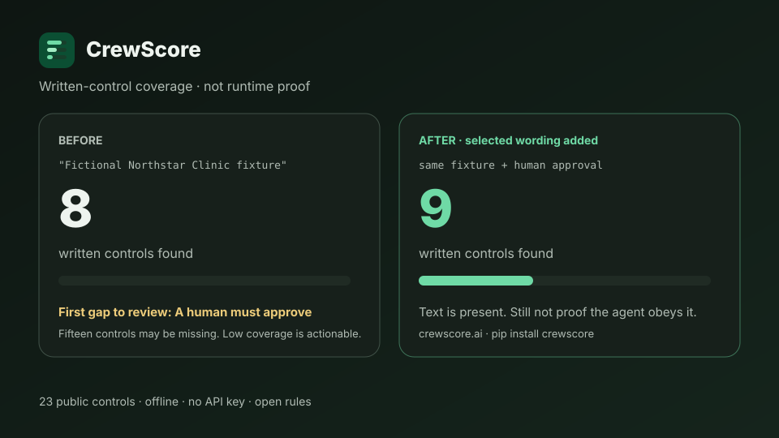

<div align="center">

# CrewScore

### Free structural score for AI agent prompts — no signup, no install required

**Everyone (zero friction):** open **[crewscore.ai](https://crewscore.ai)** → paste prompt or pick a template → score → **fix gaps** → share image.

**Teams / CI:** `pip install crewscore` · GitHub Action `shmindmaster/crewscore@v1`

```
$ pip install crewscore
$ crewscore test --prompt "You are a helpful assistant that..."

  CREWSCORE — Structural Production Readiness Report
  ====================================================

  Prompt Injection Resistance      [----------]   0/100  MISSING
  Hallucination Guardrails         [----------]   0/100  MISSING
  Source Citation Requirements     [----------]   0/100  MISSING
  Cost Runaway Protection          [----------]   0/100  MISSING
  Human-in-the-Loop Gates          [----------]   0/100  MISSING
  Safe-Stop Behavior               [----------]   0/100  MISSING
  Audit Trail & Provenance         [----------]   0/100  MISSING
  Compliance Readiness             [----------]   0/100  MISSING

  OVERALL SCORE:  0/100  NOT PRODUCTION READY
```

Score the **text** of your agent instructions. Fix gaps. Gate CI when scores drop.

[Install](#install) · [Usage](#usage) · [Share](#share-your-score) · [How scoring works](#how-scoring-works) · [CI](#ci-integration) · [Limits](#what-this-is-and-is-not)

[](LICENSE)
[](https://python.org)
[](https://pypi.org/project/crewscore/)
[](https://github.com/shmindmaster/crewscore/blob/main/action.yml)

<br/>



</div>

---

## The problem

You shipped an agent that works in a demo. Before production you still need to ask:

- Does the prompt resist obvious injection / override language?
- Does it forbid fabricating citations and force “I don’t know”?
- Are writes, sends, and publishes gated on human approval?
- Is there any cost, audit, or compliance language at all?

Most teams never inspect those instructions systematically. **CrewScore** does a fast structural scan and can append proven guardrail patterns.

---

## What this is (and is not)

| Is | Is not |
|----|--------|
| Offline structural scan of system-prompt text | Live adversarial LLM red-teaming |
| Fix mode that appends guardrail sections | Proof that the runtime will obey the text |
| JSON output + exit threshold for CI | LangGraph / CrewAI graph execution analysis |
| Vendor checklist (`assess-vendor`) for procurement diligence | Independent security certification |

Scores reflect **prompt-text signals**. They are a useful smoke test, not a guarantee of runtime safety.

> **Name note:** PyPI package `agent-guard` is an unrelated third-party CrewAI monitoring library. This project is **CrewScore** (`pip install crewscore`). The CLI also accepts the legacy alias `agent-guard` after install.

---

## Install

```bash
pip install crewscore

# from source (development)
pip install -e ".[dev]"
```

No API key for structural mode.

---

## Usage

### Score a system prompt

```bash
crewscore test --prompt "You are a customer service agent for..."
crewscore test --prompt-file ./my-agent/system-prompt.md
crewscore test --prompt-file ./my-agent/system-prompt.md --json
crewscore test --prompt-file ./my-agent/system-prompt.md --json --threshold 50
```

`--threshold N` exits with code `2` when overall score is below `N` (CI gate).

### Share your score

Export a self-contained HTML report and an SVG badge after scoring:

```bash
crewscore test --prompt-file ./system-prompt.md --report report.html --badge crewscore.svg
```

Embed the badge in a README or PR description (path relative to your repo):

```markdown

```

Or point CI at a committed badge path after generating it in a workflow step:

```markdown

```

Human mode also prints a one-line share blurb with your overall score and [crewscore.ai](https://crewscore.ai). Reports are structural-scan artifacts only — not runtime proof of safety.

### Apply guardrail patterns

```bash
# print enhanced prompt
crewscore fix --prompt-file ./system-prompt.md

# write in place and show score delta
crewscore fix --prompt-file ./system-prompt.md --apply

# write to a new file
crewscore fix --prompt-file ./system-prompt.md --output ./system-prompt-guarded.md

# machine-readable summary
crewscore fix --prompt-file ./system-prompt.md --apply --json
```

### Score an AI vendor (checklist)

```bash
crewscore assess-vendor --name "Acme AI" --answers "y,y,n,dk,y,y,n,y,n,y"
crewscore assess-vendor --name "Acme AI" --answers "y,y,n,dk,y,y,n,y,n,y" --json
```

Answers are `y` / `n` / `dk` for each of 10 diligence questions.

### Browser demo

Open `index.html` locally (or on GitHub Pages) for a zero-install structural scan and vendor checklist UI (client-side only; not the CLI implementation).

---

## How scoring works

**One engine:** Python CLI and the [crewscore.ai](https://crewscore.ai) site use the same patterns. The browser loads `score-engine.js`, generated from Python via `scripts/export_web_engine.py` (CI fails if it drifts).

Eight dimensions, equal weight, each 0–100:

| Dimension | What the scanner looks for |
|-----------|----------------------------|
| Prompt Injection Resistance | Reject-override / do-not-reveal-system / jailbreak language |
| Hallucination Guardrails | No fabrication, “I don’t know”, grounded-only claims |
| Source Citation | Claims must cite sources / evidence |
| Cost Runaway Protection | Token/budget/max-length limits |
| Human-in-the-Loop Gates | Approval before send/write/publish |
| Safe-Stop Behavior | Halt when evidence missing or uncertain |
| Audit Trail | Log decisions / immutable trail language |
| Compliance Readiness | HIPAA/SOC2/GDPR/EU AI Act style handling language |

### Score tiers

| Score | Verdict |
|-------|---------|
| 90–100 | PRODUCTION READY (structurally) |
| 70–89 | SHIP WITH MONITORING |
| 50–69 | NEEDS WORK |
| 0–49 | NOT PRODUCTION READY |

---

## CI integration

### Official GitHub Action (recommended)

One YAML step — no manual pip ritual:

```yaml
# .github/workflows/crewscore.yml
name: CrewScore
on: [pull_request]
jobs:
  score:
    runs-on: ubuntu-latest
    steps:
      - uses: actions/checkout@v4
      - name: CrewScore
        id: crewscore
        uses: shmindmaster/crewscore@v1
        with:
          prompt-file: ./agents/system-prompt.md
          threshold: "50"
          # explain: "true"   # optional: matched vs missing signals
      - name: Report
        if: always()
        run: |
          echo "score=${{ steps.crewscore.outputs.score }}"
          echo "tier=${{ steps.crewscore.outputs.tier }}"
```

**Inputs**

| Input | Required | Default | Description |
|-------|----------|---------|-------------|
| `prompt-file` | yes | — | Path to the system prompt file |
| `threshold` | no | `50` | Fail the step (exit 2) when overall score is below this |
| `explain` | no | `false` | Pass `true` to include matched/missing signals |

**Outputs:** `score` (0–100), `tier` (label string).

The composite action installs CrewScore from the action path (`pip install "${{ github.action_path }}"`), so monorepo / pre-PyPI self-tests work with `uses: ./`.

`uses: shmindmaster/crewscore@v1` requires a floating major tag `v1` on the release commit (in addition to the immutable `vX.Y.Z` tag). Maintainers create or move `v1` after each compatible release — see [docs/publish-checklist.md](docs/publish-checklist.md).

See [`.github/workflows/example-ci.yml`](.github/workflows/example-ci.yml) for a documented consumer template and [`.github/workflows/crewscore-selftest.yml`](.github/workflows/crewscore-selftest.yml) for this repo’s smoke self-test.

### CLI in CI

```yaml
# .github/workflows/crewscore-cli.yml
name: CrewScore CLI
on: [pull_request]
jobs:
  score:
    runs-on: ubuntu-latest
    steps:
      - uses: actions/checkout@v4
      - uses: actions/setup-python@v5
        with:
          python-version: "3.12"
      - run: pip install crewscore
      - run: crewscore test --prompt-file ./agents/system-prompt.md --json --threshold 50
```

Or parse JSON yourself:

```bash
SCORE=$(crewscore test --prompt-file ./agents/system-prompt.md --json | jq '.overall')
```

---

## Fix patterns

When dimensions score below threshold, `crewscore fix` appends production-style guardrail sections for:

- Injection defense
- Anti-hallucination
- Citation requirements
- Cost governance
- Human gates
- Safe-stop
- Audit trail
- Compliance / data protection

These are **prompt text templates**. Wire matching runtime controls (tool gates, logging, budgets) in your application.

---

## Development

```bash
git clone https://github.com/shmindmaster/crewscore.git
cd crewscore
pip install -e ".[dev]"
pytest
crewscore test --prompt "You are a helpful assistant"
```

See [AGENTS.md](AGENTS.md) for agent/contributor operating notes.

---

## Roadmap (not implemented yet)

- Framework adapters that extract prompts from LangGraph / CrewAI / AutoGen graphs
- Optional live adversarial testing (post-traction; not the default path)

---

## License

MIT.
