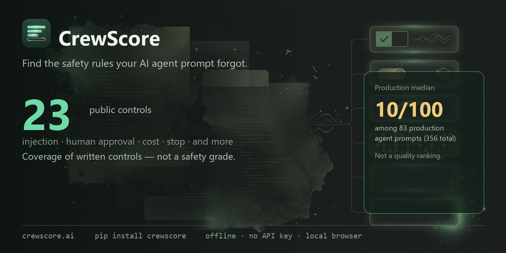
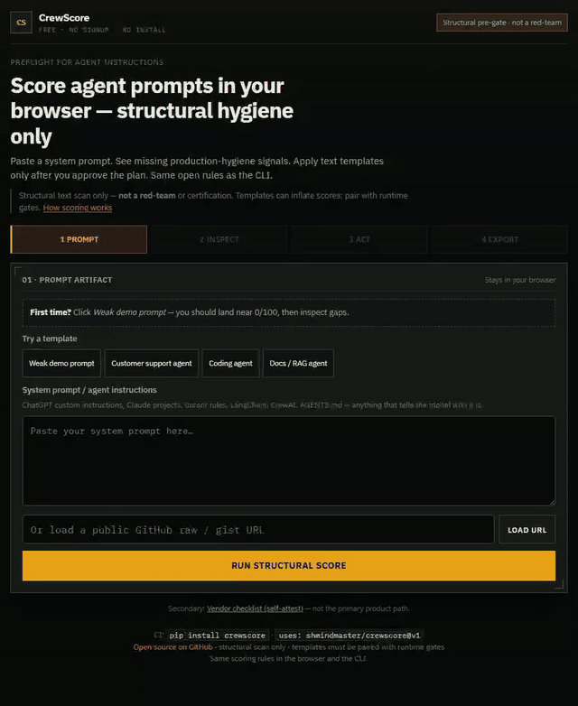

<div align="center">



# CrewScore

### CI that fails when your agent prompt never says “a human must approve.”

CrewScore finds **missing written guardrails** in agent system prompts —
injection defense, human approval, cost limits, stop conditions — **offline,
no API key, open rules**.

It is a **checklist of 23 published controls**, not a quality ranking and not
runtime red-teaming. Low coverage is actionable; high coverage only means the
text is present.

**We scanned 356 real agent prompts: 83 production prompts and 273
general-purpose prompts. Among the production subset, median coverage was 10
of 100.** GPT-Store median: 0.
[Numbers →](docs/validation-corpus.md) · [Shareable card →](docs/dist-pack/corpus-card.svg) · [Live checker →](https://crewscore.ai)

[](LICENSE)
[](https://python.org)
[](https://pypi.org/project/crewscore/)
[](https://github.com/marketplace/actions/crewscore)

<br/>

<p>
  
</p>

> Example: **control coverage 8/23 written** · hero gap: *A human must approve*.
> CrewScore checks whether controls are written down, not whether an agent obeys them.

**Try it live, no install:** [crewscore.ai](https://crewscore.ai)



</div>

```bash
pip install crewscore
crewscore scan .
# Gate the one control that matters:
crewscore scan . --require human_gate.approval_required
```

Deterministic regex over prompt text **and** `SYSTEM_PROMPT` / `system_prompt`
string literals in `.py` / `.ts` / `.js` source. **Offline, no API key, no LLM.**

---

## Read this first

**CrewScore is a checklist, not a benchmark.** The number is the share of **23
published controls** your prompt states — nothing about whether they are well
specified, mutually consistent, or obeyed at runtime.

| What the prompt does | What it scores |
| --- | --- |
| Nothing written down | **0** |
| One control in each of the 8 dimensions | **36** |
| All 23 controls | **100** |
| One control restated five different ways | same as stating it once |

So a **low score is actionable** — you probably have not written down an
injection policy, a human gate, or a safe-stop rule, and those are worth
writing. A **high score means the text is present**, not that the agent obeys
it. Don't rank prompts, teams, or vendors by this number, and don't treat a
threshold as a safety bar. Prefer the findings to the total.

Three dimensions — **Cost**, **Compliance**, **Audit** — ship with known-thin
construct validity and say so. Ruleset `0.6.0` tightened their patterns against
measured corpus false positives; Compliance is still not lawful handling.

📄 **[The validation study →](docs/validation.md)** — including the arithmetic
showing our own scale was broken through `0.1.0`, which we published before
fixing.

📊 **[Measured against 356 real prompts →](docs/validation-corpus.md)** —
Cliff's δ = 0.614 separating production agent prompts from general-purpose
ones, generated by a committed harness rather than typed by hand.

---

## Usage

```bash
crewscore scan .                          # prompts + AGENTS.md + inline SYSTEM_PROMPT=...
crewscore scan . --no-inline              # file discovery only
crewscore init .                          # prompt-free regression baseline + PR workflow
crewscore scan . --fail-on-regression --baseline .crewscore-baseline.json
crewscore scan . --require human_gate.approval_required   # one-control CI habit
crewscore test --prompt-file ./prompt.md  # coverage N/23 + hero gap
crewscore fix  --prompt-file ./prompt.md --plan   # what's missing, no writes
crewscore rules --concepts                # the 23 controls, and the rules behind them
```

**[Full CLI reference →](docs/cli.md)** · **[How scoring works →](docs/scoring-and-controls.md)**

---

## CI

```yaml
- uses: shmindmaster/crewscore@v2
  with:
    scan-path: "."
    # Report-only by default. Protect controls explicitly instead of treating
    # the coverage average as a safety bar:
    required-controls: "human_gate.approval_required,safe_stop.stop_condition"
    sarif: "crewscore.sarif"
```

Posts a sticky PR comment with the open rule findings. Guard downstream steps
on the `scored` output, not on `score` — an empty score casts to `0`.

**[Action inputs, outputs, and the CLI variant →](docs/github-action.md)**

---

## Two artifacts, two rulesets

CrewScore judges two kinds of file, and tells you which it thinks it is looking
at. Detection is by filename and path — never by sniffing content.

| Artifact | Examples | Judged on |
|----------|----------|-----------|
| **Coding-agent config** | `AGENTS.md`, `CLAUDE.md`, `.cursorrules` | Configuration smells |
| **Agent system prompt** | `system-prompt.md`, anything under `prompts/` or `agents/` | The 8 governance dimensions |

A file saying *"always use pnpm"* is telling a coding agent how to work in your
repo. It has no reason to contain HIPAA language, and scoring it against that
is a category error.

We know the size of that error because we measured it: against the 100
most-starred repos with an `AGENTS.md`
([arXiv:2606.15828](https://arxiv.org/abs/2606.15828)), the governance ruleset
put **all 100 in the worst tier**. A scale the entire population fails carries
no information. So config files get a smell verdict instead — and in `--json`,
no governance grade at all.

```bash
crewscore test --prompt-file AGENTS.md
# -> CONFIG: NO SMELLS DETECTED   (not "0/100 CRITICAL GAPS")
```

---

## Configuration smells

Problems in the *shape* of an instruction file rather than its content, from a
published catalog —
[*Configuration Smells in AGENTS.md Files*](https://arxiv.org/abs/2606.15828)
(dos Santos et al., 2026), which found **91 of 100** popular projects carried
at least one.

| Smell | Heuristic | Found in |
|-------|-----------|----------|
| **Context Bloat** | ≥ 200 lines | 42% of studied projects |
| **Lint Leakage** | Style rules a configured linter already enforces | 62% |
| **Init Fossilization** | Tracked by git with exactly one commit | 24% |

The paper's other three smells need an LLM to detect. We would rather ship
three honest detectors than six approximate ones. Lint Leakage is an
approximation of the paper's detector and says so in its output; Init
Fossilization cannot tell "never needed revising" from "never got revised."

**Smells never change the score.** Folding them in would silently change what
every existing `--threshold` means.

---

## Development

```bash
git clone https://github.com/shmindmaster/crewscore.git
cd crewscore
pip install -e ".[dev]"
pytest
```

**[Development guide →](docs/development.md)** · [AGENTS.md](AGENTS.md) ·
[CONTRIBUTING.md](CONTRIBUTING.md)

---

## Docs

| | |
|---|---|
| [Validation](docs/validation.md) | What the number does and does not measure |
| [Corpus validation](docs/validation-corpus.md) | Generated result over 356 real prompts |
| [Scoring and controls](docs/scoring-and-controls.md) | Formula, 23 controls, charter, governance |
| [CLI](docs/cli.md) | Every command and flag |
| [GitHub Action](docs/github-action.md) | Action inputs/outputs and CLI-in-CI |
| [Policies and SARIF](docs/policies.md) | Regression and required-control CI without score gating |
| [Architecture](docs/architecture.md) | Modules, data flow, lean target |
| [Development](docs/development.md) | Local setup, rules, packaging, media |
| [Live eval handoff](docs/next-steps-eval.md) | Promptfoo / garak after structural gate |
| [Roadmap](docs/roadmap.md) | Available work and deliberately deferred capabilities |
| [Security](SECURITY.md) | Private vulnerability reporting |
| [Community discussions](https://github.com/shmindmaster/crewscore/discussions) | Questions, adoption feedback, and open-ended ideas |
| [Comparison](docs/comparison.md) | Other tools, and what to use after this one |
| [CHANGELOG](CHANGELOG.md) | Including every scoring change and its measured delta |
| [Cleanup inventory](docs/cleanup-and-completion.md) | What this lean-product pass retained, completed, and deferred |

---

## What this is not

Live adversarial red-teaming · runtime tool-gate enforcement · a security or
compliance certification · proof the model will obey the text.

**Roadmap:** framework adapters that extract prompts from LangGraph / CrewAI /
AutoGen graphs; optional live adversarial testing (post-traction, not the
default path).

MIT licensed.
